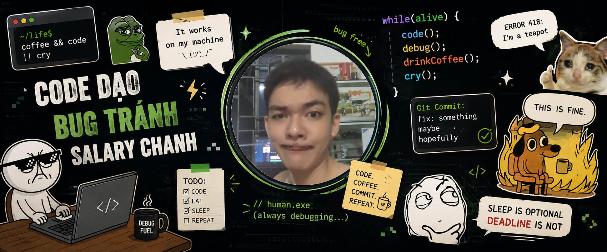

<!--Banner-->

<!-- This is fine Meme -->

  

<!--Header Name-->

#  ɪ'ᴍ Cường (GMIOS)! 👋

_Learner / Full-stack Software Engineer_
 

<!--Start Intro-->

I am a Full-stack Software Engineer with a huge love for Java, React.js, Node.js, Spring, RDBMS, REST API and Data Visualization. 

- ✨ Student of life :)
- 🌱 I’m currently learning many things, I believe that everyday is a learning opportunity.
  <!-- - 💁♂️ Trusted member and Moderator at [DEV Community](https://dev.to)-->
  <!-- - 🏙 A lifetime insider and Mentor at [Exercism](https://exercism.org/profiles/gmios25).-->
  <!-- - ✍ I write technical blogs, You can visit my blog site at [DEV](https://dev.to/dev_kiran).-->
  <!-- - ❤ Contributing to Open Source.-->
  <!-- - 💻 Visit my [Portfolio](https://kirannaragund.com) for more details about me.-->
  <!--End Intro-->

<!--Profile Count Badge-->

  

---

<!--Languages and Tools Section-->
<h2 align="center">Tᴇᴄʜ sᴛᴀᴄᴋ & Lᴀᴛᴇsᴛ ʙʟᴏɢs</h2> 
<picture>
  <source media="(prefers-color-scheme: dark)" srcset="./Skills_Animation_Dark.gif">
  <source media="(prefers-color-scheme: light)" srcset="./Skills_Animation_White.gif">
  
</picture>
 

<h3 align="left">Current Learning</h3>
<ul align="left">
  <li>Deepening my knowledge in System Design, Architecture, Microservices and Clean Code.</li>
  <li>Exploring advanced Java patterns and Spring Framework.</li>
  <li>Improving my skills in cloud computing with AWS and Azure.</li>
  <li>I'm hunting for a scholarship to study abroad.</li>
</ul>
  
<!-- <h3 align="left">Latest Blog Posts</h3>
<ul align="left">
  <li><a href="https://dev.to/dev_kiran/storyblok-mcp-server-let-ai-agents-manage-your-content-3jaa">🔥Storyblok MCP Server: Let AI Agents Manage Your Content 🤖</a></li>
  <li><a href="https://dev.to/dev_kiran/pulstack-deploy-your-static-site-to-s3-or-github-in-1-min-5cin">🔥Pulstack: Deploy your static site to S3 or GitHub in <1 min🙂</a></li>
  <li><a href="https://dev.to/dev_kiran/i-tried-out-qodos-new-embed-model-qodo-embed-1-40h5">I Tried Out Qodo's New Embed Model Qodo-Embed-1🤯</a></li>
</ul> -->
 
 
 
 
 
 
 
 

<!--Trophies Section-->
<h2 align="center">🏆 Gɪᴛʜᴜʙ Tʀᴏᴘʜɪᴇs 🏆</h2>

  <a href="https://github.com/gmios25">
    <picture>
      <source media="(prefers-color-scheme: dark)" srcset="https://github-profile-trophy-ruddy.vercel.app/?username=gmios25&no-bg=true&row=2&column=6&margin-w=20&margin-h=20&theme=monokai">
      <source media="(prefers-color-scheme: light)" srcset="https://github-profile-trophy-ruddy.vercel.app/?username=gmios25&no-bg=true&row=2&column=6&margin-w=20&margin-h=20">
      
    </picture>
  </a>

  

 

<!--Github stats Table-->
<h2 align="center">📊 Gɪᴛʜᴜʙ Sᴛᴀᴛs 📊</h2>

<table width="100%">
  <tr>
    <td width="50%">
      <h3 align="center"><strong>Gɪᴛʜᴜʙ Sᴛᴀᴛs</strong></h3>
      

        
      

    </td>
    <td width="50%">
      <h3 align="center"><strong>Sᴛʀᴇᴀᴋ Sᴛᴀᴛs</strong></h3>
      

        
      

    </td>
  </tr>
  <tr>
    <td width="50%">
      <h3 align="center"><strong>Lᴀᴛᴇsᴛ Pʀᴏᴊᴇᴄᴛ</strong></h3>
      

        
      

    </td>
    <td width="50%">
      <h3 align="center"><strong>Tᴏᴘ Cᴏɴᴛʀɪʙᴜᴛɪᴏɴs</strong></h3>
      

        
      

    </td>
  </tr>
</table>
 

<!--Contribution Graph-->
<h2 align="center">📈 Cᴏɴᴛʀɪʙᴜᴛɪᴏɴ Gʀᴀᴘʜ 📈</h2>

    

---

<!--Dynamic Quote card updates everyday at 12 PM-->
<h2 align="center">🌟 Tʜᴏᴜɢʜᴛ ᴏғ ᴛʜᴇ Dᴀʏ 🌟</h2>

<!--STARTS_HERE_QUOTE_CARD-->

    

<!--ENDS_HERE_QUOTE_CARD-->

<!--Contact Section-->

<h2 align="center">🤝 Cᴏɴɴᴇᴄᴛ Wɪᴛʜ Mᴇ 🤝 </h2>

  

 

<!--Buy me a coffee-->

<!--Footer-->

  

